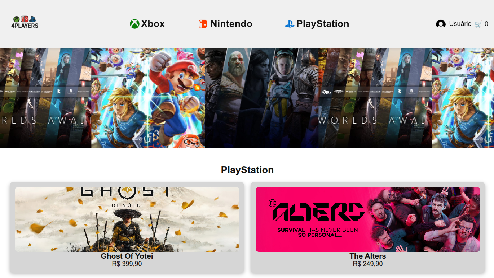

# 4Players




# 🕹️ Projeto Site de Vendas de Jogos

Este é um projeto web desenvolvido como parte dos meus estudos em desenvolvimento front-end. O objetivo é simular uma loja virtual de jogos com páginas dedicadas a diferentes plataformas (PlayStation, Xbox e Nintendo), além de funcionalidades como cadastro de usuário, carrinho de compras e alternância de tema claro/escuro.

## 🚀 Funcionalidades

- Página inicial com destaque para as principais plataformas.
- Páginas específicas para jogos de:
  - 🎮 PlayStation
  - 🧩 Xbox
  - 🍄 Nintendo
- Cadastro de usuário com formulário interativo.
- Carrinho de compras funcional com JavaScript.
- Tema claro/escuro com salvamento no `localStorage`.
- Interface responsiva e compatível com dispositivos móveis.

## 🛠️ Tecnologias Utilizadas

- **HTML5** – Estruturação do conteúdo com tags semânticas.
- **CSS3** – Estilização e responsividade, com sistema de temas.
- **JavaScript (puro)** – Interatividade das páginas e lógica do carrinho.
- **LocalStorage** – Armazena a preferência de tema do usuário.

## 📁 Estrutura de Arquivos

```
4Players/
   ├── 📁 Cadastro
   │   ├── 📁 img
   │   │   ├── 🖼️ controllerWallpaper.jpg
   │   │   └── 🖼️ iconGame.png
   │   ├── 🎨 cadastro.css
   │   ├── 🌐 cadastro.html
   │   └── 📄 cadastro.js
   ├── 📁 HomePage
   │   ├── 📁 Banner
   │   │   ├── 🖼️ Banner-Nintendo-Studios.jpg
   │   │   ├── 🖼️ Banner-PS-Studios.jpg
   │   │   └── 🖼️ Banner-xbox-Studios.jpg
   │   ├── 📁 games_nintendo
   │   │   ├── 🖼️ Earthworm_Jim_Super.jpg
   │   │   ├── 🖼️ Final_Fight.jpg
   │   │   ├── 🖼️ Legend_of_Zelda_Breath_of_the_Wild_capa.png
   │   │   ├── 🖼️ Mario Kart 8 S pass.jpg
   │   │   ├── 🖼️ Mario_Kart_8_Deluxe.jpg
   │   │   ├── 🖼️ Super_Mario_64.jpg
   │   │   ├── 🖼️ Super_Mario_Allstar.jpg
   │   │   ├── 🖼️ Super_Mario_Party.png
   │   │   ├── 🖼️ bomberman-generation-17334.jpg
   │   │   ├── 🖼️ castlevania_dracula_x.jpg
   │   │   └── 🖼️ the-legend-of-zelda-tears-of-the-kingdom_cover.jpg
   │   ├── 📁 games_playstation
   │   │   ├── 🖼️ Fallout76.jpg
   │   │   ├── 🖼️ Ghost_of_Tsushima_capa.png
   │   │   ├── 🖼️ GodofWar.jpg
   │   │   ├── 🖼️ Star_Wars_Jedi_Fallen_Order_capa.png
   │   │   ├── 🖼️ UntilDawn.jpg
   │   │   ├── 🖼️ Wildarms.jpg
   │   │   ├── 🖼️ dinocrisis.jpg
   │   │   ├── 🖼️ ghost-of-yotei-game-3840x2160-19048.jpg
   │   │   ├── 🖼️ starwars.jpg
   │   │   ├── 🖼️ the-alters.jpg
   │   │   └── 🖼️ thealters.png
   │   ├── 📁 games_x-box
   │   │   ├── 🖼️ Dishonored 2.jpg
   │   │   ├── 🖼️ Doom.jpg
   │   │   ├── 🖼️ Forza Motorsport 6.jpg
   │   │   ├── 🖼️ Halo_Infinite_capa.png
   │   │   ├── 🖼️ Sea-Of-Thieves-Emblema.jpg
   │   │   ├── 🖼️ dishonored.jpg
   │   │   ├── 🖼️ doomEternal.jpg
   │   │   ├── 🖼️ gears of wars.png
   │   │   ├── 🖼️ senuasSacrifice.jpg
   │   │   └── 🖼️ senuasSaga.jpg
   │   ├── 📁 img
   │   │   ├── 🖼️ LogoNintendo.png
   │   │   ├── 🖼️ LogoPS.png
   │   │   ├── 🖼️ capaNint.jpg
   │   │   ├── 🖼️ capaNint2.jpg
   │   │   ├── 🖼️ ghost-of-yotei-game-3840x2160-19048.jpg
   │   │   ├── 🖼️ logoProjeto.png
   │   │   ├── 🖼️ logoXbox.png
   │   │   └── 🖼️ user.png
   │   ├── 🎨 Cart.css
   │   ├── 🌐 Cart.html
   │   ├── 📄 Cart.js
   │   ├── 🌐 Nintendo.html
   │   ├── 🌐 Playstation.html
   │   ├── 🌐 Xbox.html
   │   ├── 🎨 carrossel.css
   │   ├── 🎨 gamepagestyle.css
   │   └── 🌐 user.html
   ├── 📁 Login
   │   ├── 📁 forgotPassword
   │   │   ├── 📁 img
   │   │   │   └── 🖼️ iconGame.png
   │   │   ├── 🌐 forgotPassword.html
   │   │   ├── 📄 forgotPassword.js
   │   │   └── 🎨 forgotPasword.css
   │   ├── 📁 img
   │   │   └── 🖼️ user.png
   │   ├── 🎨 login.css
   │   ├── 🌐 login.html
   │   └── 📄 login.js
   ├── 📁 img
   │   ├── 🖼️ error.png
   │   ├── 🖼️ iconGame.png
   │   ├── 🖼️ imgProject-Photoroom.png
   │   └── 🖼️ user.png
   ├── 📁 utils
   │   └── 📄 utils.js
   ├── 📝 README.md
   ├── 🌐 erro.html
   ├── 🎨 homePage.css
   ├── 📄 homePage.js
   ├── 🌐 index.html
   ├── 🎨 transition.css
   └── 📄 transition.js
```

## 📦 Como Usar

1. Clone o repositório:
   ```bash
   git clone https://github.com/tenmenezes/Projeto-Site-Vendas.git
   ```

2. Acesse a pasta do projeto:
   ```bash
   cd Projeto-Site-Vendas
   ```

3. Abra o arquivo `homePage.html` no seu navegador para iniciar o site.

## 🧩 Funcionalidades Futuras

- Integração com backend para cadastro real.
- Validação de formulário aprimorada.
- Melhorias na responsividade para dispositivos menores.
- Filtro de jogos por categoria, preço e plataforma.

## 📄 Licença

Este projeto está sob a licença MIT. Veja o arquivo [LICENSE](LICENSE) para mais detalhes.

## 👤 Autor

Feito com 💻 por:
[@tenmenezes](https://github.com/tenmenezes)
[@Thiago-Rock](https://github.com/Thiago-Rock)
[@ClaudinoGomes](https://github.com/ClaudinoGomes)
[@Bruno-Washington](https://github.com/Bruno-Washington)

Sinta-se à vontade para contribuir, sugerir melhorias ou relatar problemas!

